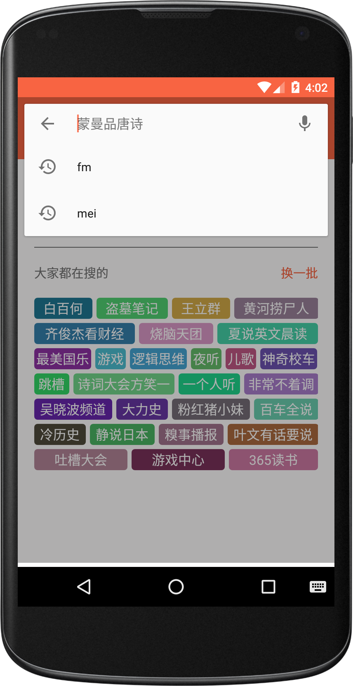
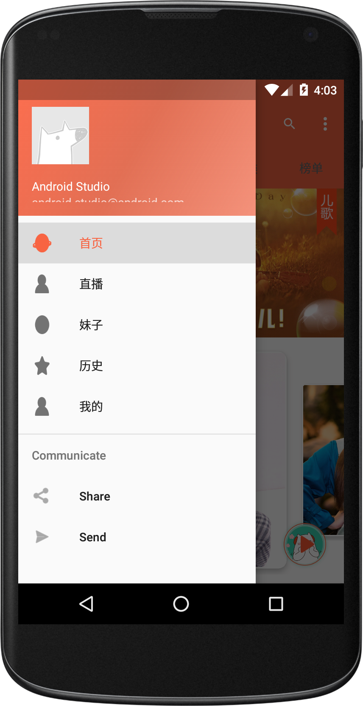

#FM

## Api声明

* app所有的api都来 [喜马拉雅FM](http://www.ximalaya.com/explore/)/[映客直播](http://www.inke.cn/)/[干货集中营](http://gank.io/api);一切数据都归以上三者所有。

* 该项目仅供交流学习使用，如果该项目有侵犯版权问题，或被告知需停止共享与使用，本人会及时删除此页面与整个项目。

## 简介

* 一款音乐内容基于喜马拉雅FM,直播内容基于inke,图片内容基于Gank的多功能娱乐客户端

* 界面风格遵循Material Design设计规范，tablayout和viewpager配合使用切换各个模块，viewpager切换fragment

* 整体界面采用了沉浸式布局，具有日夜间模式切换功能

* 项目整体采用mvp+rxjava+retrofit+dagger2 框架，用butterknif注解，使用fresco进行图片展示

* 首页分为五大模块，推荐、热门、主播、分类、榜单

* inke模块, 具备观看直播功能 创建直播间功能等

* 待续..

## 截图

## 说明

*  开发时间比较短,许多地方有待优化

*  注释较少,有时间把注释加上
 
*  还有许多功能没有实现,有时间慢慢的补上

*  有什么问题,可通过下面的方式跟我联系交流

## 感谢

* [RXJava](https://github.com/ReactiveX/RxJava)
* [RxAndroid](https://github.com/ReactiveX/RxAndroid)
* [okhttp](https://github.com/square/okhttp)
* [retrofit](https://github.com/square/retrofit)
* [butterknif](https://github.com/JakeWharton/butterknife)
* 等等..

## 关于我

一个对技术有着强烈的追求开发者

## 联系我

 - Email:1069467658@qq.com
 - GitHub: [lanboys](https://github.com/lanboys)